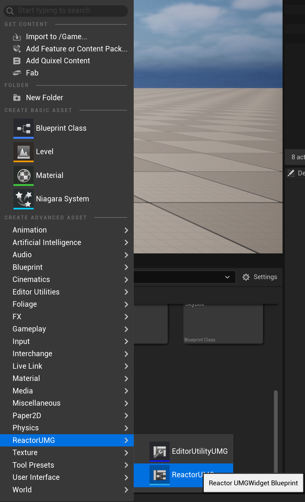
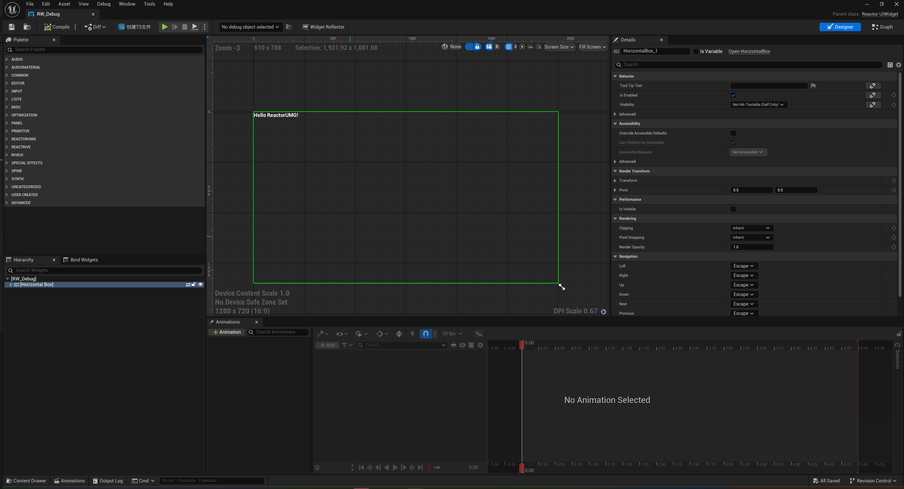
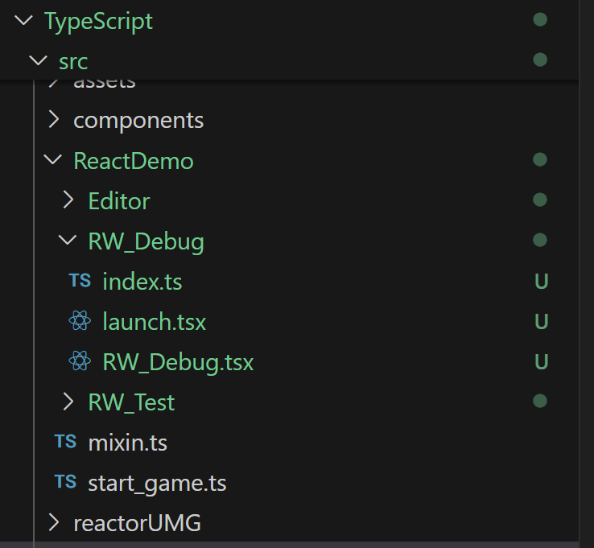
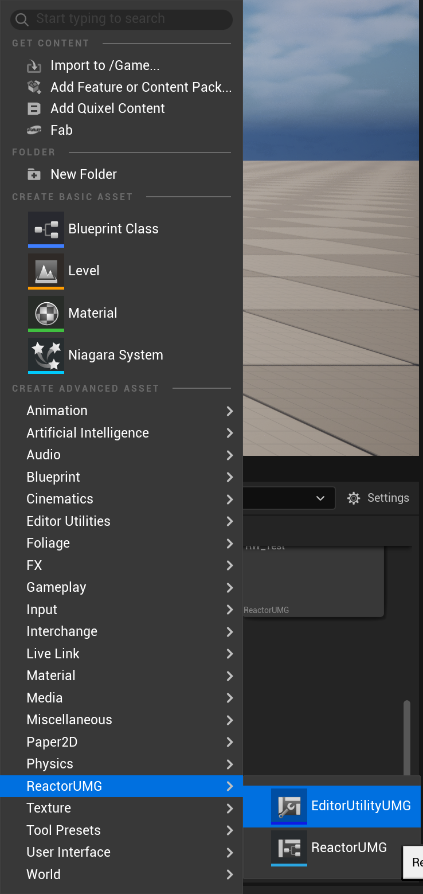
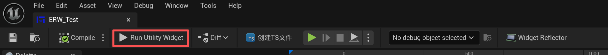

# ReactorUMG


> **Keywords:** Unreal Engine, UE5, UMG, UI, Slate, React, TypeScript, Plugin, Hot Reload, Live Preview, Puerts/PuertsTS, Game UI Framework

⚠️ **Alpha Stage:** APIs and structure may change before a stable release.

⚠️ **Before You Start:** Please read the **FAQ** first to avoid common pitfalls.

---

[跳转中文](README_zh.md)

## Table of Contents
- [ReactorUMG](#reactorumg)
  - [Table of Contents](#table-of-contents)
  - [Overview](#overview)
  - [Why ReactorUMG](#why-reactorumg)
  - [Key Features](#key-features)
  - [Requirements](#requirements)
  - [Install \& Quick Start](#install--quick-start)
    - [Install Node.js and a Package Manager](#install-nodejs-and-a-package-manager)
    - [Get the Plugin](#get-the-plugin)
    - [Place the Folder](#place-the-folder)
    - [Enable the Plugin](#enable-the-plugin)
    - [Initialize Environment](#initialize-environment)
    - [Create UI](#create-ui)
      - [Create Runtime UI](#create-runtime-ui)
      - [Create Editor UI](#create-editor-ui)
  - [Project Layout Example](#project-layout-example)
  - [Runtime UI Supported Platforms](#runtime-ui-supported-platforms)
  - [FAQ](#faq)
  - [Roadmap](#roadmap)
  - [Contributing](#contributing)
  - [License](#license)
  - [Links \& Resources](#links--resources)

---

## Overview
ReactorUMG is a helper plugin for Unreal Engine that lets you build **UMG** game UI and editor UI using **React**.  
It is built on **Puerts/PuertsTS** and uses text-based code that works well with AI tools, so you can iterate quickly like a web front‑end workflow.

## Why ReactorUMG
UMG is powerful, but it does not have a text-first, web-like development flow. That makes it harder to reuse AI and front‑end practices (components, hot reload, linting, tests).  
**ReactorUMG** lets you build UI with **React + TypeScript**, preview changes live, and bring modern web development methods into Unreal UI work.

---

## Key Features
- **React Components:** Function/class components, hooks, JSX/TSX.
- **Reusable UI:** Build and share components for design systems/skins.
- **Scripted Logic:** Write interactions in TypeScript and reuse the front‑end ecosystem.
- **Live Preview & Hot Reload:** Save to refresh; validate layout and logic fast.
- **Examples Included:** From simple to advanced templates.
- **AI-Friendly:** Text code makes generation and refactoring easy for LLMs.
- **UI Animation:** Import **Spine** and **Rive** animations for UI.

---

## Requirements
- Unreal Engine **5.x**
- **Node.js ≥ 18** and **Yarn / PNPM / NPM** (choose one)
- VSCode / Cursor (recommended)
- Windows 10/11, Linux

---

## Install & Quick Start

### Install Node.js and a Package Manager
Standard Node.js setup. Yarn is recommended as the package manager.

### Get the Plugin
- Download the latest **ReactorUMG** release, or clone this project.
- Place the plugin source under `Plugins/ReactorUMG` in your UE project.

### Place the Folder
- Project: `<YourUEProject>/Plugins/ReactorUMG`  
- Engine (optional): `<UE_5.x>/Engine/Plugins/Marketplace/ReactorUMG`

### Initialize Environment
Run `setup_win.bat` in `Plugins/ReactorUMG/Tools` to set up the environment.

### Enable the Plugin
UE → `Edit > Plugins` → search **ReactorUMG** → enable → restart if needed.

### Create UI

#### Create Runtime UI
- Launch the project (build first if using the source build).
- In Content Browser, create **ReactorUIWidget** via **ReactorUMG → ReactorUMG**.  
  
- The system compiles and loads scripts. Double‑click the asset to open the starter page.  
  
- The plugin generates a UI folder and template files at  
  `<ProjectDir>/TypeScript/src/<ProjectName>/<AssetPath>` (see *Project Layout*).  
  
- **Do not edit** the auto‑generated `launch.tsx` (boot file).
- Your UI entry is `<AssetName>.tsx` (for example `RW_Debug.tsx`). Add your React code there.
- Use your UI like any UMG widget: create it with `CreateWidget` in Blueprints/C++.

#### Create Editor UI
- Launch the project (build first if using the source build).
- In Content Browser, create **EditorUtilityWidget** via **ReactorUMG → EditorUtilityUMG**.  
  
- Templates are generated at  
  `<ProjectDir>/TypeScript/src/<ProjectName>/Editor/<AssetPath>` (note the `Editor` folder).
- You can preview and iterate directly in the UI editor.  
  

> **Naming Tip:** Use `RW_`* for runtime UI and `ERW_`* for editor UI.

---

## Project Layout Example
```plain
MyProject/
├─ Content/                        # UE assets
│  └─ JavaScript/                  # JS output
├─ Plugins/
│  └─ ReactorUMG/                  # Plugin
│     ├─ Scripts/
│     │  ├─ Project/src/reactorUMG/# Project templates
│     │  └─ System/JavaScript/     # System scripts
│     └─ Source/                   # C++ source
├─ TypeScript/                     # Auto-generated React/TS workspace
│  ├─ src/
│  │  ├─ MyProject/                # Editor/Runtime UI
│  │  │  ├─ Editor/                # Editor UI
│  │  │  └─ RW_Test/               # Runtime UI scripts
│  │  │     ├─ index.tsx
│  │  │     ├─ launch.tsx          # UI bootstrap (do not modify)
│  │  │     └─ RW_Test.tsx         # Actual UI code
│  │  ├─ reactorUMG/               # Framework
│  │  └─ types/                    # Puerts/UE types
│  ├─ node_modules/
│  ├─ tsconfig.json
│  └─ package.json
└─ MyProject.uproject
```

**Notes**
- **JavaScript**: system JS and TS build output. Package as non‑asset so runtime scripts can load.
- **TypeScript**: front‑end style project root.
- **TypeScript/src/MyProject**: auto‑generated UI scripts and your edits.

---

## Runtime UI Supported Platforms
- Windows, Android, Linux

---

## FAQ
**Q: How does this relate to UMG/Slate?**  
A: ReactorUMG is for teams who want to build UI with **React**, while still relying on UE rendering and the Puerts bridge.

**Q: What about performance?**  
A: It depends on your UI complexity and state updates. Keep components small, lift state, avoid unnecessary re‑renders, and disable dev‑only overhead when shipping.

---

## Roadmap
- [ ] Tailwind CSS support

---

## Contributing
Contributions are welcome: bug reports, docs, feature requests, pull requests.

1. Fork and branch: `feat/your-feature` or `fix/your-bug`  
2. Run local examples  
3. Ensure checks pass: `yarn build && yarn lint && yarn test`  
4. Open a PR with motivation, impact, and how you tested

---

## License
**MIT License**. See `LICENSE`.

---

## Links & Resources
- **Docs Home:** (TBD)
- **Sample Project:** (TBD)
- **Releases:** (TBD)
- **Issues:** (TBD)
- **Discussions:** (TBD)
